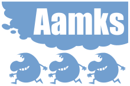

Aamks is a linux platform for assessing fire safety of humans in buildings.
Aamks runs hundreds of fire simulations (CFAST) and evacuation simulations
(Aamks.Evac) and then evaluates the results. In each simulation humans
are moving across the building and are affected by fire and smoke. 

Aamks workflow:

	- user defines the project variables

		- NUMBER_OF_SIMULATIONS=N
		- BUILDING_CATEGORY="office"
		- ...

	- user creates the geometry with Aamks.Apainter in Google Chrome
	- Aamks creates N of CFAST and Aamks.Evac input files 
	- Aamks dispatches and manages the simulations in a network
	- Aamks collects the simulations results in a Postgres database
	- Aamks compiles the N results into distributions for the report
	- Aamks.Animator displays the animations based on the simulations

Aamks is web-based so doesn't need to be installed. Aamks uses such
technologies as Navmesh and RVO2.

Aamks is not production ready, but you can have a look 
on 
