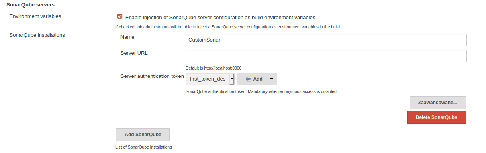
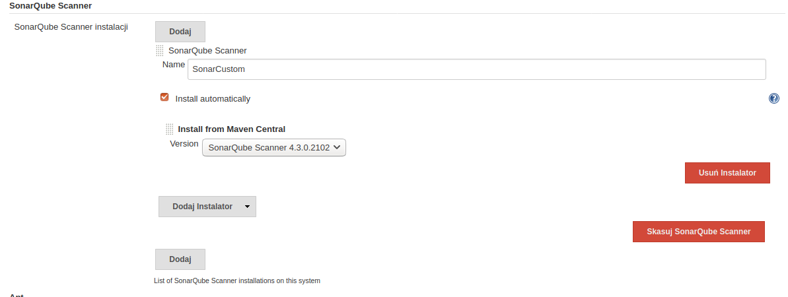

# How to install and configure Jenkins and SonarQube Servers
## Requirements 
* Ubuntu 18.04
* Installed Java 11

## Install and run Jenkins
1 Install Jenkins via repository
```
wget -q -O - https://pkg.jenkins.io/debian/jenkins-ci.org.key | sudo apt-key add -
sudo sh -c 'echo deb http://pkg.jenkins.io/debian-stable binary/ > /etc/apt/sources.list.d/jenkins.list'
sudo apt-get update
sudo apt-get install jenkins
```
2 Copy unlock key
```
sudo cat /var/lib/jenkins/secrets/initialAdminPassword
```
3 Go to Jenkins server, create first user's account and install recommended plugins
```
server_IP:8080
localhost:8080
``` 

## Install and run PostgreSQL and Sonar
1 Install PosgreSQL via repository
```
wget --quiet -O - https://www.postgresql.org/media/keys/ACCC4CF8.asc | sudo apt-key add -
sudo sh -c 'echo deb http://apt.postgresql.org/pub/repos/apt/ bionic-pgdg main > /etc/apt/sources.list.d/pgdg.list'
sudo apt-get update
apt-get install postgresql-12
```
To verify installation:
```
sudo systemctl status postgresql
```
2 Create Sonar database in pSQL <br>
Switch to postgresql user and create sonar database user
```
su - postgres
createuser sonar
``` 
Switch to postgresql 
```
psql
```
Create database
```
ALTER USER sonar WITH ENCRYPTED password 'password';
CREATE DATABASE sonar OWNER sonar;
```
Quit shell
```
\q
```
3 Install and configure SonarQube <br>
Add linux sonar user
```
sudo adduser sonar
```
Download and unzip binary files
```
wget https://binaries.sonarsource.com/Distribution/sonarqube/sonarqube-8.2.0.32929.zip
unzip sonarqube-8.2.0.32929.zip
sudo cp -r sonarqube-8.2.0.32929 /opt/sonarqube
```
Change ownership
```
sudo chown -R sonar:sonar /opt/sonarqube
```
Edit sonar.sh
```
sudo nano /opt/sonarqube/bin/linux-x86-64/sonar.sh
```
Modify following line:
```
RUN_AS_USER=sonar
```
Edit sonar.properties
```
sudo nano /opt/sonarqube/conf/sonar.properties
```
Modify following values:
```
sonar.jdbc.username=sonar
sonar.jdbc.password=password
sonar.jdbc.url=jdbc:postgresql://localhost/sonar
```

4 Create sonar service 
```
sudo nano /etc/systemd/system/sonar.service
```
Add following lines:
```
[Unit]
Description=SonarQube service
After=syslog.target network.target

[Service]
Type=forking

ExecStart=/opt/sonarqube/bin/linux-x86-64/sonar.sh start
ExecStop=/opt/sonarqube/bin/linux-x86-64/sonar.sh stop

User=sonar
Group=sonar
Restart=always

[Install]
WantedBy=multi-user.target
```
Start service
```
sudo systemctl start sonar
sudo systemctl enable sonar
sudo systemctl status sonar
```
Verify sonar logs:
```
tail -f /opt/sonarqube/logs/sonar.log
```
SonarQube should running on 
```
server_IP:9000
localhost:9000
```
### Known error on Ubuntu: 
* Low max_map_count <br>
To resolve increase it by edit sysctl.conf
```
sudo nano /etc/sysctl.conf
```
Add to last line: 
```
vm.max_map_count=262144
```
Reload config:
```
sudo sysctl -p
```
Restart system

* Low system-wide resources <br>
To resolve, increase user system resources
1 Edit limits.conf
```
sudo nano /etc/security/limits.conf
```
Add following property to end of file 
```
sonar           soft    nofile          65535
sonar           hard    nofile          65536
root            soft    nofile          65535
root            hard    nofile          65536
```

2 Edit user.conf and system.conf. 
```
sudo nano /etc/systemd/user.conf
sudo nano /etc/systemd/system.conf
```
Add following line to each file 
```
DefaultLimitNOFILE=1048576
```
3 Restart system
## Connect Jenkins and SonarQube
1 Create sonar user and generate security token
```
http://server_IP:9000/admin/users
```

2 Install SonarQube Scanner plugin, go to:
```
http://server_IP:8080/pluginManager/
```
3 Find And install SonarQubeScanner
4 Go to Jenkins configuration:
```
http://server_IP:8080/configure
```
Config as screen bellow, and add token from sonar user (kind security text)



5 Config SonarQUbe scanner 
```
http://server_IP:8080/configureTools/
```


## Jobs configuration
### Send sonar to master
Create new base job (project) and add following steps:
1 Select repository and branch
2 Execute shell (calculate coveredge)
```
python -m pytest tests/unit/evac/test_evacuee.py --cov-report=xml --cov=evac
```
3 Execute SonarQubeScanner <br>
Properties:
```
sonar.projectKey=project-name
sonar.exclusions=dev/**
sonar.python.coverage.reportPaths=coverage.xml
```

### Run Unit tests
Create new base job (project) and add following steps:
1 Select repository and branch
2 Execute shell: 
```
python -m pytest -v tests/unit/evac/test_evacuees.py --junit-xml=results.xml
```
3 Publish JUnit test result report <br>
file name: 
```
results.xml
```
## Sources
```
https://pkg.jenkins.io/debian/
https://wiki.jenkins.io/display/JENKINS/Installing+Jenkins+on+Ubuntu

https://www.postgresql.org/download/linux/ubuntu/
https://www.howtoforge.com/how-to-install-sonarqube-on-ubuntu-1804/

https://unix.stackexchange.com/questions/366352/etc-security-limits-conf-not-applied
```
